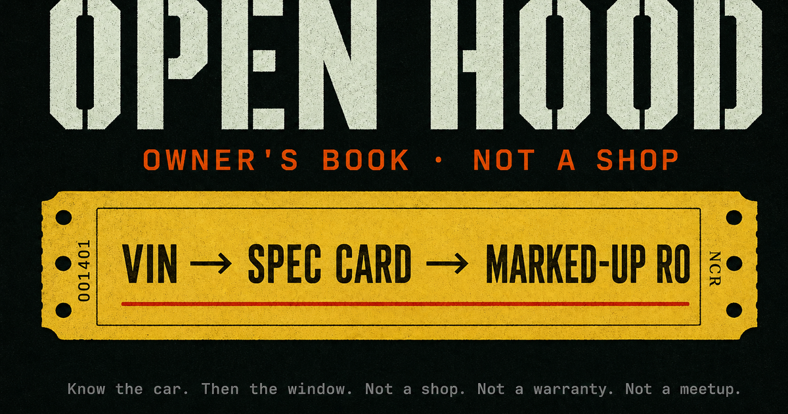

# Open Hood

**Know the car. Then the window.**

[Live demo](https://open-hood.vercel.app) · Next.js 16 · TypeScript · Vercel · MIT



Open Hood is an owner's advocate — not a shop marketplace.

1. Identify the car (VIN or year / make / model).
2. Ask about a quote line, a noise, or a scanner code.
3. Copy three sentences and say them at the service window.

We do not book shops, invent Carfax, or sell Motor hours.

## 90-second walk (use this on a phone)

1. Open [https://open-hood.vercel.app](https://open-hood.vercel.app).
2. Tap **Try the demo · 2003 Honda Accord** (VIN `1HGCM82633A004352`).
3. Confirm oil **5W-20** and **3.0L** on the spec card.
4. In **Ask**, tap **$89 cabin filter** (or type `They quoted $89 for a cabin filter`).
5. Tap **Copy the three lines**.
6. Optional: open **Ticket** (`/quote`) and paste a real RO.

If a yellow “Add to home screen” bar covers Ask, tap **Not now** once. That bar is not the product.

Demo lock: that Honda VIN always prints 5W-20. A junk VIN returns 400. Empty licensed keys stay empty.

## Pages (waiting room)

| Stamp | URL | What you do |
| --- | --- | --- |
| Ask | [/#ask](https://open-hood.vercel.app/#ask) | Type a line, a noise, or a code |
| Car | [/](https://open-hood.vercel.app/) | VIN or year / make / model |
| Ticket | [/quote](https://open-hood.vercel.app/quote) | Paste or photo the estimate |
| Script | [/mechanic-mode](https://open-hood.vercel.app/mechanic-mode) | Print / copy the sentences |
| Spec | [/garage](https://open-hood.vercel.app/garage) | Oil, PSI, filters |
| Code | [/obd](https://open-hood.vercel.app/obd) | Type `P0420` from any $20 scanner |
| Noise | [/symptoms](https://open-hood.vercel.app/symptoms) | Sound + when it happens |
| Parts | [/parts](https://open-hood.vercel.app/parts) | Catalog search URLs — not stock |
| Maps | [/shops](https://open-hood.vercel.app/shops) | Maps + questions. No booking cut |
| Recalls | [/recalls](https://open-hood.vercel.app/recalls) | NHTSA year/make/model. Dealer closes VIN |

**Lab desks** (finder, auctions, jobs, builds, OSM directory) stay folded. They are not the demo.

## How it is built

- Next.js 16 App Router, React 19, Tailwind 4
- NHTSA vPIC VIN decode + SaferCar recalls
- EPA FuelEconomy.gov MPG
- OpenStreetMap rooftops (no booking)
- Local typical-hour book for quote flags
- `POST /api/agent` tools first; OpenAI only if the key answers 200
- `sessionStorage` only. No user accounts

```bash
npm install
npm test
npm run dev
```

`OPENAI_API_KEY` is optional. A 429 means typed tools still answer.

## What this is not

RepairPal books a shop. YourMechanic sends a person. Carfax sells a file. AutoZone sells a SKU. We send a script.

## Portfolio / public repo

This is an original DigitalCurrensy project, not a fork. Checklist to publish: [docs/PUBLIC-LAUNCH.md](docs/PUBLIC-LAUNCH.md).

Topics: `automotive` `nextjs` `typescript` `vercel` `nhtsa` `vin` `consumer-protection` `repair` `pwa` `openai`

License: [MIT](LICENSE)
