# Open Hood

**Know the car. Then the window.**

[Live demo](https://open-hood.vercel.app) · [CI](https://github.com/DigitalCurrensy/open-hood/actions) · Next.js 16 · TypeScript · Vercel · MIT

An owner’s advocate for the service counter — not a shop, not Carfax, not a booking cut.

1. Identify the car (VIN or year / make / model).
2. Mark the repair order, a noise, or a scanner code.
3. Copy three sentences and say them at the window.

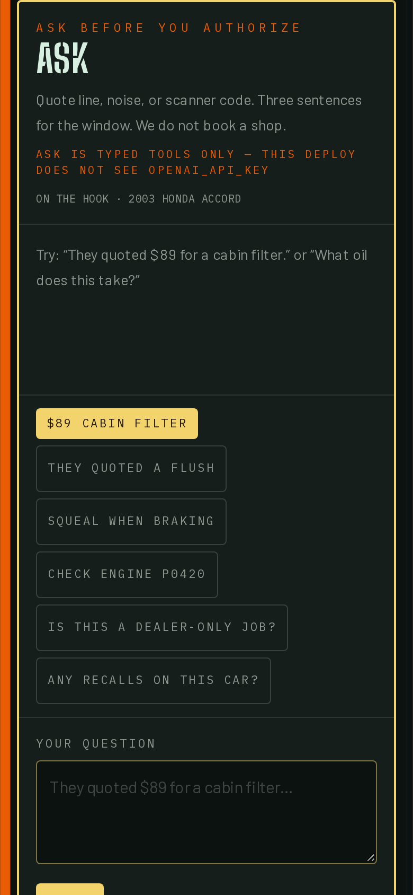

Demo lock: VIN `1HGCM82633A004352` is a **2003 Honda Accord**. Oil **5W-20**. Engine **3.0L**. A junk VIN returns 400. Empty licensed keys stay empty.

---

## 90-second walk (phone)

1. Open **[open-hood.vercel.app](https://open-hood.vercel.app)**.
2. Tap **Try the demo · 2003 Honda Accord**.
3. Confirm **5W-20** and **3.0L** on the spec card.
4. In **Ask**, type `They quoted $89 for a cabin filter` (or tap the cabin-filter chip).
5. Tap **Copy the three lines**.
6. Optional: **Ticket** (`/quote`) to paste a real RO → **Script** (`/mechanic-mode`) to print.

If a yellow “Add to home screen” bar covers Ask, tap **Not now**. That bar is not the product.

Production Ask is **typed tools** (NHTSA, fluids book, typical-hour flags). `OPENAI_API_KEY` is optional and **off** on the public demo so nobody can run an OpenAI bill. Local/Vercel can turn the key on; a 429 still falls back to tools.

---

## Waiting-room path

Four stamps on the rail. Everything else stays folded.

| Stamp | URL | Job |
| --- | --- | --- |
| **Ask** | [/#ask](https://open-hood.vercel.app/#ask) | Quote line, noise, or code → copyable sentences |
| **Car** | [/](https://open-hood.vercel.app/) | VIN or year / make / model |
| **Ticket** | [/quote](https://open-hood.vercel.app/quote) | Paste or photo the estimate |
| **Script** | [/mechanic-mode](https://open-hood.vercel.app/mechanic-mode) | Print / copy what you will say |

Owner tools (spec, OBD, noise, parts, maps, recalls) sit under **Owner tools**. Lab desks stay closed. They are not the demo.

### Home + Ask

Identify the car, then talk to the desk. No account.

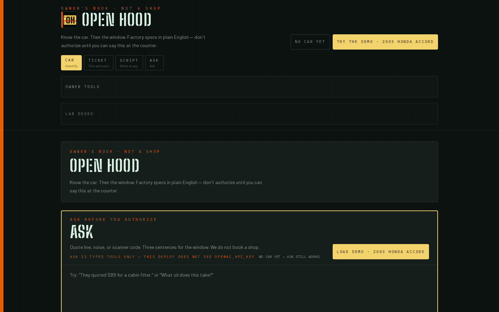

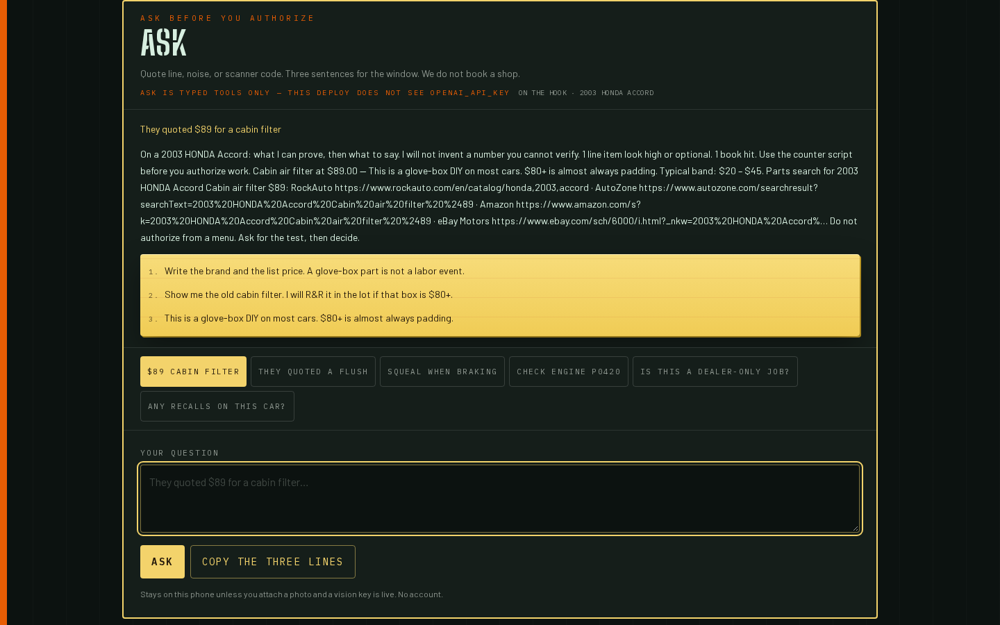

### Ticket

Paste the RO. Typical-hour flags, not Motor hours. We do not invent a price we cannot see.

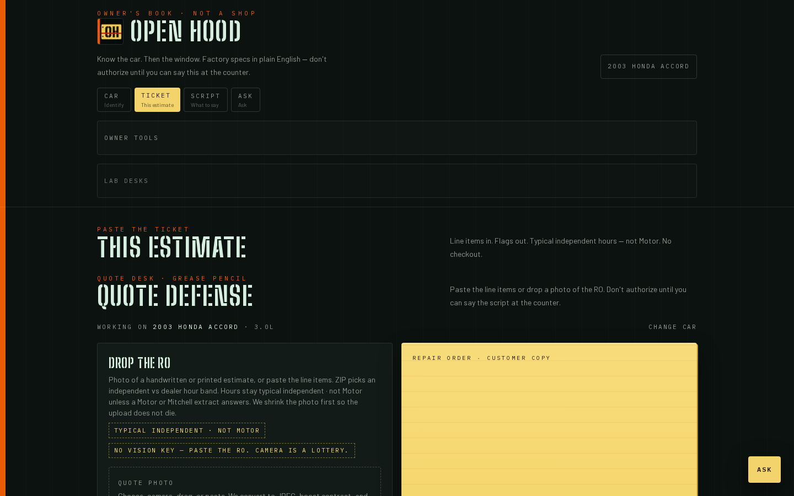

### Script

Three lines you can say. Copy or print.

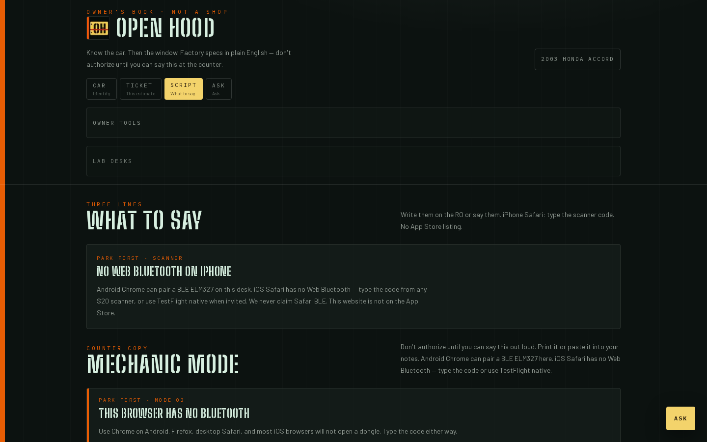

### Spec / garage

Oil, PSI, filters from the fluids book. Door jamb still wins.

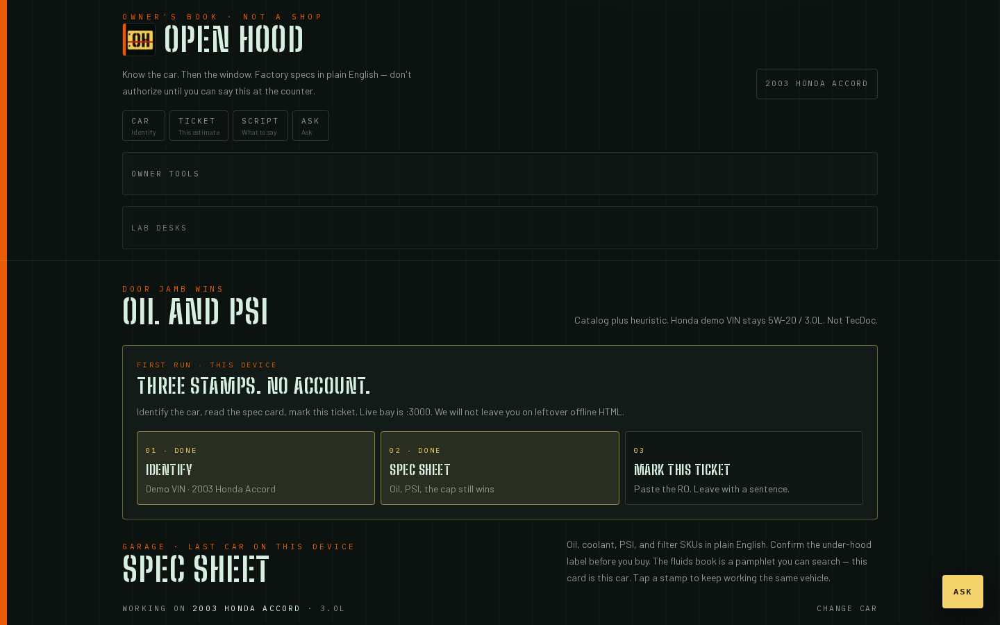

### Code

Type `P0420` from any $20 scanner. Layperson first.

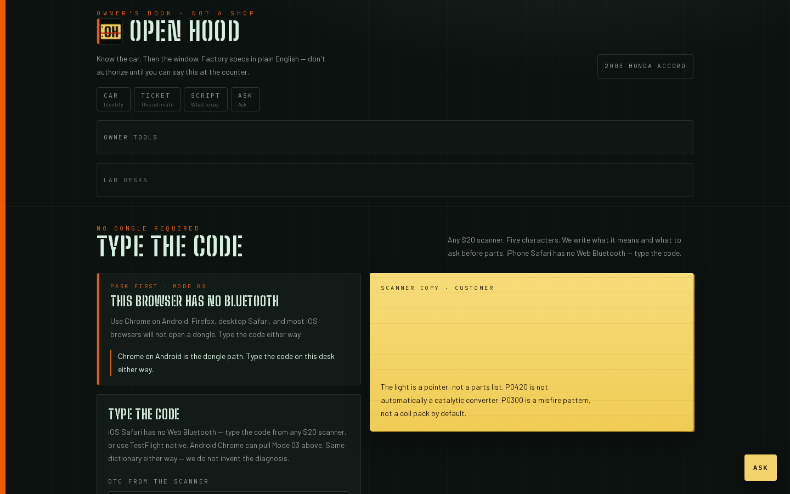

### Noise

Sound + when it happens → questions for the shop.

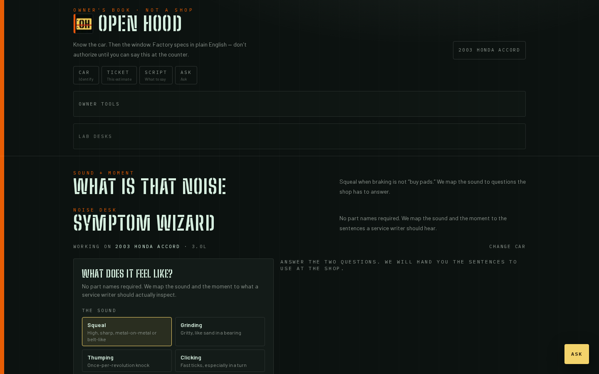

### Parts / shops / recalls

Search URLs, not stock. Maps without a booking cut. NHTSA nameplate recalls; the dealer closes VIN open/closed on SaferCar.

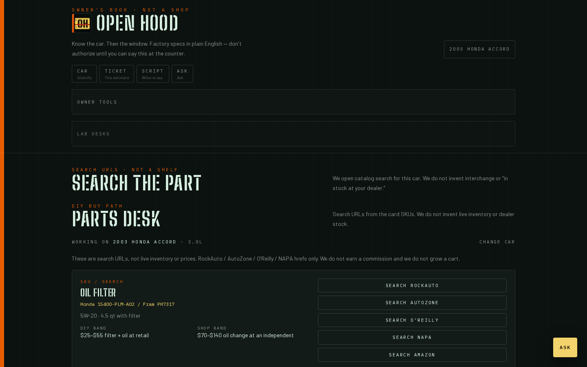

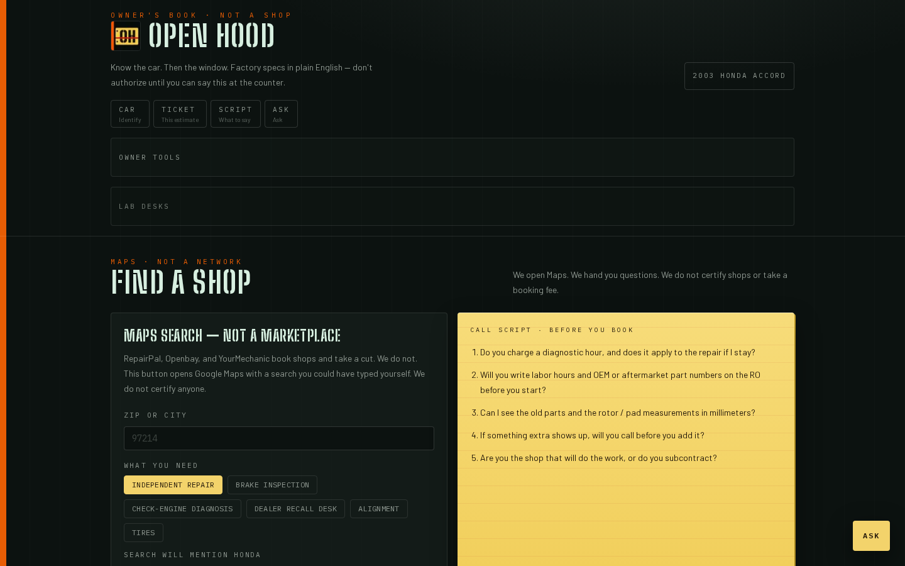

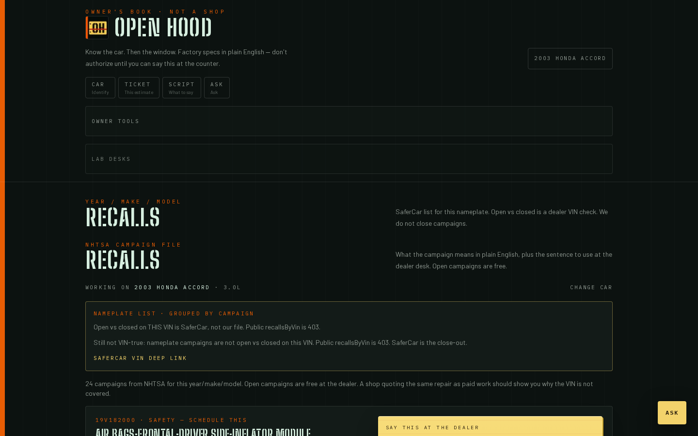

---

## What this is not

| Them | Us |
| --- | --- |
| RepairPal books a shop | We send a script |
| Carfax sells a file | We link SaferCar. No fake history |
| AutoZone sells a SKU | We open a search URL. No inventory |
| Motor / Mitchell hours | Typical-hour book, labeled as such |
| Escrow / “pay the shop” | Refused until money movement is real |

No user accounts. State lives in `sessionStorage` on this device.

---

## How it is built

- **Next.js 16** App Router, **React 19**, **Tailwind 4**
- **NHTSA vPIC** VIN decode + SaferCar recalls
- **EPA** FuelEconomy.gov MPG
- **OpenStreetMap** rooftops (no Places key required)
- Local **typical-hour** quote book + fluids catalog
- `POST /api/agent` — tools first; `gpt-4o` only if `OPENAI_API_KEY` returns 200
- GitHub Actions: `npm test` · `tsc` · `eslint` on `main`
- PWA pin is optional. Not an app-store listing

```bash
npm install
npm test
npm run dev
```

Copy `.env.example` → `.env.local`. Leave keys blank unless you have a real vendor. An empty key is `configured: false`. We do not paint a live control for paper licenses.

---

## Status (honest)

| Piece | Live demo |
| --- | --- |
| VIN → spec → script | Yes |
| Honda demo lock | Yes |
| Ask (typed tools) | Yes |
| Ask (OpenAI / vision) | Off on production |
| Carfax / Motor / Chrome / escrow | Not connected — on purpose |

Operator notes: [docs/PUBLIC-LAUNCH.md](docs/PUBLIC-LAUNCH.md) · product paper: [docs/WHITEPAPER.md](docs/WHITEPAPER.md) · brand: [docs/BRAND.md](docs/BRAND.md)

Original DigitalCurrensy project. Not a fork.

License: [MIT](LICENSE)
